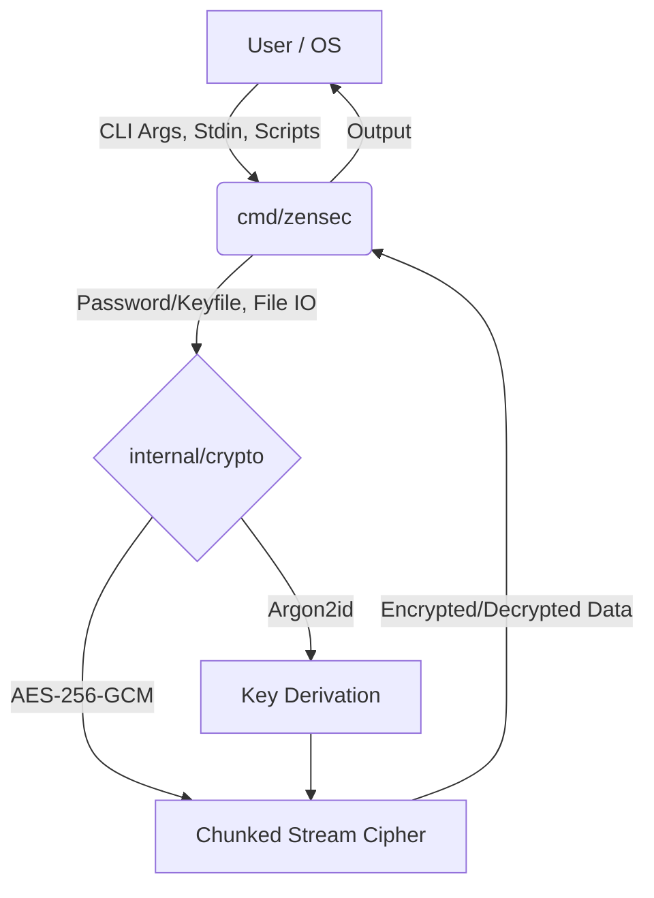

# ZenSec 🔐

[](https://goreportcard.com/report/github.com/ViolaPeracia/ZenSec)
[](https://golang.org/doc/go1.23)
[](LICENSE)
[](https://github.com/ViolaPeracia/ZenSec/actions)

**ZenSec** is a small command-line utility for encrypting and decrypting local files. Written in Go, it follows the UNIX philosophy: *do one thing and do it well*.

ZenSec uses Go's standard cryptography (AES-256-GCM, Argon2id via `golang.org/x/crypto`) and depends on two reviewed modules in total: `golang.org/x/crypto` and `golang.org/x/term`. There is no UI framework and no transitive dependency tree to audit.

---

## 📑 Table of Contents
- [Features](#-features)
- [Architecture](#-architecture)
- [Getting Started](#-getting-started)
- [Usage Guide](#-usage-guide)
- [Security](#-security)
- [Documentation](#-documentation)
- [License](#-license)

---

## ✨ Features

* **Small, Auditable CLI:** A straightforward Command-Line Interface built on the standard `flag` package. Two module dependencies, both under `golang.org/x`.
* **Strong Cryptography:**
  * **AES-256-GCM:** Authenticated streaming encryption. Any modification to the ciphertext makes decryption fail rather than return wrong data.
  * **Argon2id:** Memory-hard key derivation at 64 MiB / 3 passes, above the OWASP baseline, to slow offline guessing of weak passwords.
* **Verified Against Tampering:** Every chunk carries its index in both the nonce and the associated data, so chunks cannot be reordered or swapped. The container header is authenticated and the plaintext length is recorded, so truncation is detected even at a chunk boundary.
* **Atomic Writes:** Output is written to a temporary file and renamed into place only after the last chunk succeeds. A wrong password or a tampered file leaves the destination untouched instead of destroying it.
* **Memory Efficient:** Processes files of any size using a fixed 64 KiB working buffer.
* **UX & Safety Mechanisms:**
  * Double-prompt password confirmation prevents data loss from typos.
  * Overwrite prompts before touching an existing file, with `-yes` for automation.
  * Output files are created with `0600` permissions on POSIX systems.
* **Automation & OS Integration:**
  * **Keyfile Support:** Use any file (an image, a PDF, a text file) as key material. Maximum 1 MiB.
  * **Cross-Platform Batch Processing:** Native scripts for both Windows (`.bat`) and macOS/Linux (`.sh`).
  * **Windows Context Menu:** Right-click → "Encrypt with ZenSec" via registry integration.

---

## 🏗 Architecture

ZenSec strictly separates its cryptographic core from the user interface and OS integration layers.



---

## 🚀 Getting Started

### Prerequisites
* [Go 1.25+](https://go.dev/doc/install) (if building from source)

### Installation

Clone the repository and build the standalone binary:

```bash
git clone https://github.com/ViolaPeracia/ZenSec.git
cd ZenSec

go mod download

# Build the executable
go build -o zensec ./cmd/zensec
```

> **Pro-Tip:** Move `zensec.exe` to a folder in your system's `PATH` (e.g., `C:\Windows\System32` on Windows or `/usr/local/bin` on Linux) so you can run it from anywhere.

---

## 🛠️ Usage Guide

### 1. Standard Encryption & Decryption (Password)

Encrypt a file:
```bash
zensec -encrypt -file my_secret.txt
```
*(You will be securely prompted to type and confirm your password)*

Decrypt a file:
```bash
zensec -decrypt -file my_secret.txt.enc
```

### 2. Keyfile Mode (Passwordless)

Instead of a password, you can use any file as your key. This is useful for automation or for keeping key material on removable media.

```bash
# Encrypt using an image as the key
zensec -encrypt -file backup.zip -keyfile D:\my_secret_key.jpg

# Decrypt using the same image
zensec -decrypt -file backup.zip.enc -keyfile D:\my_secret_key.jpg
```

> **Note:** keyfile bytes are used exactly as they are on disk, including a
> trailing newline. Create keyfiles with `printf 'secret' > key`, not
> `echo secret > key`, because the two produce different keys. ZenSec warns when
> a keyfile ends in whitespace.

### 3. Automation Flags

`-yes` suppresses the overwrite prompt, for scripts and CI. `-out PATH` chooses
the destination explicitly.

```bash
zensec -encrypt -file backup.zip -keyfile key.bin -out backup.zip.enc -yes
```

### 4. Batch Processing (Directories)

Need to encrypt an entire folder? Use the included native scripts. They will prompt you for the folder path, your keyfile, and automatically process every file inside.

* **Windows:** Double-click `batch_zensec.bat`
* **macOS/Linux:** Run `./batch_zensec.sh`

### 5. Windows Context Menu (Right-Click)

1. Ensure `zensec.exe` is in your `PATH`.
2. Run the included `install_context_menu.reg` as Administrator. It registers under `HKEY_CLASSES_ROOT\*\shell`, which applies to all users on the machine.
3. Right-click any file and choose **"Encrypt with ZenSec"** or **"Decrypt with ZenSec"**.

---

## 🔒 Security

- **No hardcoded secrets:** salt, nonce prefix and all randomness come from `crypto/rand`.
- **Authenticated chunks:** each 64 KiB chunk's index is bound into both the GCM nonce and the associated data, so reordering or substitution fails.
- **Truncation detection:** the last chunk is marked, *and* the plaintext length is recorded in the authenticated header, so truncation is caught even at a chunk boundary.
- **No silent truncation or padding:** data appended after the final chunk is rejected, so a modified file never decrypts as if it were whole.
- **Authenticated header:** editing the salt, nonce, chunk size or KDF parameters makes the file fail with a distinct "corrupted header" error rather than a generic one.
- **Atomic output:** nothing is written to the destination until the whole file verifies.
- **Private permissions:** output files are created with `0600` on POSIX systems.
- **Range-checked parameters:** KDF costs and chunk sizes are validated before use, so a hostile file cannot request a huge allocation.

Known limitations are listed in [security.md](security.md); the reasoning behind
each control is in [docs/threat-model.md](docs/threat-model.md).

---

## 📚 Documentation

For an in-depth look at the internal architecture, please refer to our documentation files:
* [Security Design](security.md) - Container format, what each control prevents, known limitations.
* [Threat Model](docs/threat-model.md) - Assets, trust boundaries, threat table, review checklist.
* [Project Overview](docs/overview.md) - Philosophy and structural architecture.
* [Features Detail](features.md) - Deep dive into technical capabilities.
* [Roadmap](Roadmap.md) - Project history and status.

---

## 📄 License

This project is licensed under the [GNU General Public License v3.0 (GPL-3.0-only)](LICENSE).
